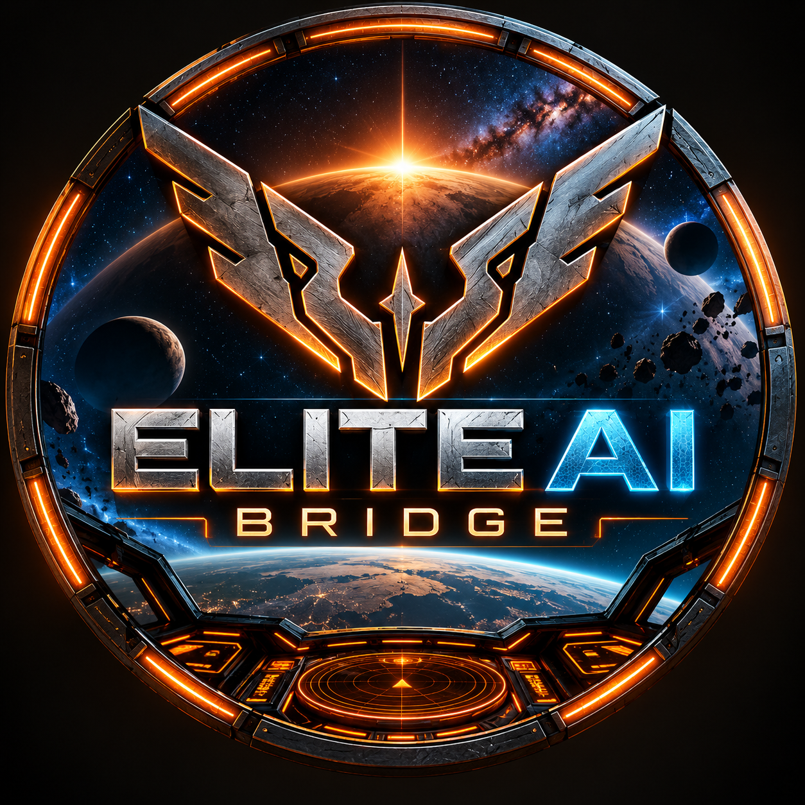

  

# Elite AI Bridge

**A cockpit-inspired Windows companion for Elite Dangerous.**

Elite AI Bridge brings live game data, navigation, trading, combat tools, control
mapping, an in-game overlay, voice control, and an optional AI co-pilot together in one
interface.

**Version 1.0.0**

## Download

For normal installation, use the compiled Windows installer attached to the
**v1.0.0 GitHub Release**:

`Elite_AI_Bridge_Setup_1.0.exe`

Do **not** download the repository source unless you want to inspect or build the project.

## Highlights

- Live Elite Dangerous journal/state integration
- Navigation and route tools
- Trade and market tools
- Combat information and target artwork
- Keyboard/HOTAS command mapping
- In-game HUD/chat overlay for Borderless or Windowed Elite
- Voice interaction and Push-to-Talk
- Optional OpenAI-powered AI Co-Pilot
- Core Bridge mode works without an OpenAI API key
- On-demand System Check and diagnostics
- 48 packaged ship/target portraits
- User settings preserved separately from program files

## Install

1. Download `Elite_AI_Bridge_Setup_1.0.exe` from the GitHub **v1.0.0 Release**.
2. Run the installer.
3. Launch Elite AI Bridge.
4. Follow the first-run setup wizard.
5. Choose **Core Bridge** or configure the optional **AI Co-Pilot**.

The installer prepares the required private Python runtime and dependencies. An internet
connection may be required during first installation.

## AI Co-Pilot / OpenAI

AI features are optional. **Core Bridge does not require an OpenAI API key.**

If you enable AI features, you supply your own OpenAI API account/key and are responsible
for your own OpenAI usage, billing, limits, and applicable terms. Elite AI Bridge does
not include API credits or an OpenAI subscription.

Never publish or share your secret API key. See
[Privacy and API Keys](docs/PRIVACY_AND_API_KEYS.md).

## Overlay

The optional overlay provides Bridge/AI state and chat information over Elite Dangerous.
Elite must run in **Borderless** or **Windowed** mode for the overlay. Exclusive Fullscreen
is not supported by the overlay.

## Documentation

- [Privacy and API Keys](docs/PRIVACY_AND_API_KEYS.md)
- [Disclaimer](docs/DISCLAIMER.md)
- [Third-Party Notices](docs/THIRD_PARTY_NOTICES.md)
- [Changelog](CHANGELOG.md)
- [Release Notes](RELEASE_NOTES_v1.0.0.md)

## Support Development

**Elite AI Bridge is free to use.**

If the Bridge adds something to your cockpit and you want to help keep development moving,
voluntary tips help support continued development, testing, and future features:

### https://ko-fi.com/eliteaibridge

## Bugs and Support

For a reproducible problem, include:
- Elite AI Bridge version
- Windows version
- What you were doing
- What you expected
- What happened instead
- Relevant Bridge diagnostics/support export

**Review diagnostic packages before posting them publicly. Never post an API key.**

## Building the Windows Installer

The `installer/` directory contains the Inno Setup 6 definition and build helper used for
the official Windows installer. See [installer/README.md](installer/README.md).

## License / Independence

See [LICENSE.txt](LICENSE.txt).

Elite AI Bridge is an independent community-developed companion application. It is not
affiliated with, sponsored by, approved by, or endorsed by Frontier Developments plc or
OpenAI.

Elite Dangerous and related names, marks, game content, and intellectual property belong
to Frontier Developments plc and/or their respective rights holders.
